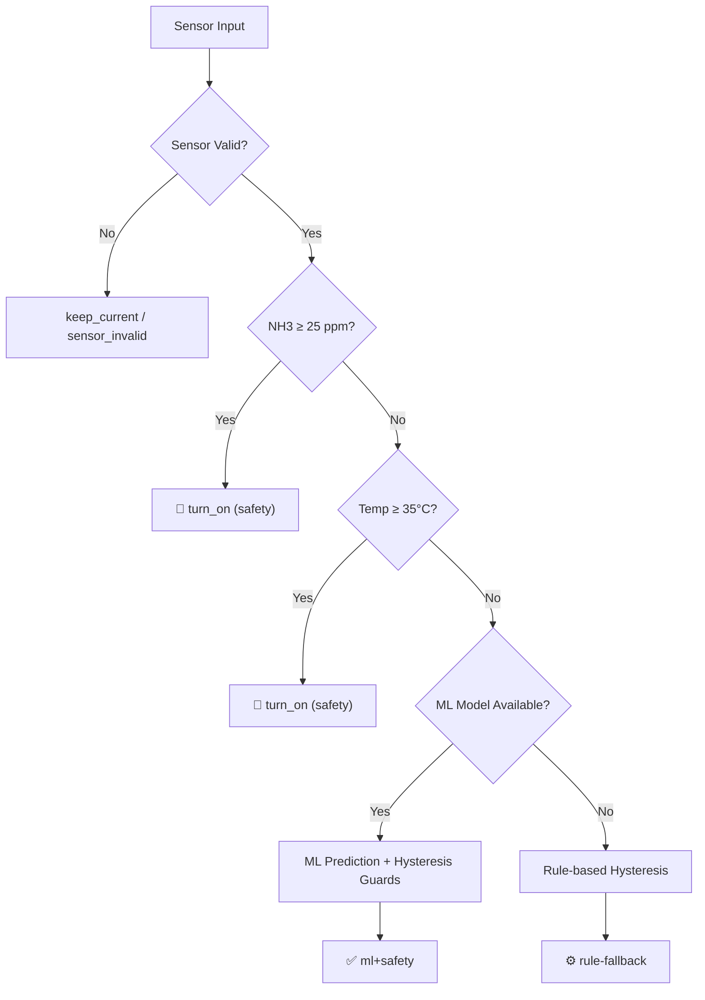

# 🐦 Swiftlet AI Engine — API Documentation

**Version:** 2.0.0  
**Base URL:** `http://localhost:8000`  
**Framework:** FastAPI  

---

## Table of Contents

1. [Health & System](#1-health--system)
2. [Decision Endpoints](#2-decision-endpoints)
3. [Pump Spray Control](#3-pump-spray-control)
4. [Anomaly Detection](#4-anomaly-detection)
5. [Grade Prediction](#5-grade-prediction)
6. [Real-Time Buffer](#6-real-time-buffer)
7. [Feedback Loop](#7-feedback-loop)
8. [Engine Types](#8-engine-types)

---

## 1. Health & System

### `GET /health`

Quick health check termasuk status model ML.

**Response:**
```json
{
  "status": "ok",
  "has_anomaly_model": true,
  "has_grade_model": true,
  "version": "2.0.0"
}
```

---

### `GET /health_db`

Cek koneksi database.

**Response (DB aktif):**
```json
{ "db": "ok" }
```

**Response (DB tidak diset):**
```json
{ "db": "disabled", "hint": "Set env DATABASE_URL untuk mengaktifkan DB." }
```

---

### `GET /version`

Info versi service dan mapping kelas model.

**Response:**
```json
{
  "service": "swiftlet-ai-engine",
  "version": "2.0.0",
  "model_classes": { "0": "bagus", "1": "buruk", "2": "sedang" }
}
```

---

## 2. Decision Endpoints

### `POST /decide`

Endpoint keputusan legacy. Menggabungkan grade prediction, **pump ML**, dan anomaly detection.

**Request Body:**

| Field | Type | Required | Description |
|-------|------|----------|-------------|
| `node_id` | string | ✅ | ID sensor node |
| `temperature_c` | float | ❌ | Suhu (°C) |
| `humidity_rh` | float | ❌ | Kelembaban (%) |
| `nh3_ppm` | float | ❌ | Amonia (ppm) |
| `extra_features` | object | ❌ | Fitur tambahan (delta, avg) |
| `timestamp` | float | ❌ | Epoch timestamp |
| `request_id` | string | ❌ | ID untuk tracking |

**Response:**
```json
{
  "grade": "bagus",
  "probabilities": { "bagus": 0.85, "sedang": 0.10, "buruk": 0.05 },
  "sprayer_on": true,
  "sprayer_reason": "ml_pump_state_on",
  "anomaly": {
    "verdict": "normal",
    "iso_pred": 1,
    "iso_score": -0.12,
    "flags": []
  },
  "used_thresholds": {
    "temp_on": 30.5, "temp_off": 29.5,
    "rh_on": 83.0, "rh_off": 75.0
  },
  "note": "Pump engine: ml+safety; grade & anomaly pakai model v2.",
  "debug": {
    "node_id": "node-01",
    "is_on": true,
    "elapsed_since_change_s": 12.5,
    "min_on_s": 20.0,
    "min_off_s": 40.0,
    "cooldown_remaining_s": 0.0,
    "pump_engine": "ml+safety",
    "pump_confidence": 0.92,
    "pump_duration_s": 15.5
  },
  "request_id": null
}
```

---

### `POST /v2/decide` ⭐ _Recommended_

Endpoint keputusan enhanced dengan **sliding window buffer** untuk rolling features. Gunakan ini untuk production.

**Request Body:**

| Field | Type | Required | Default | Description |
|-------|------|----------|---------|-------------|
| `node_id` | string | ✅ | — | ID sensor node |
| `temperature_c` | float | ✅ | — | Suhu (°C) |
| `humidity_rh` | float | ✅ | — | Kelembaban (%) |
| `nh3_ppm` | float | ✅ | — | Amonia (ppm) |
| `timestamp` | float | ❌ | `time.time()` | Epoch timestamp |
| `use_buffer` | bool | ❌ | `true` | Gunakan buffer rolling features |
| `request_id` | string | ❌ | `null` | ID untuk tracking |

**Response:**
```json
{
  "grade": "bagus",
  "probabilities": { "bagus": 0.90, "sedang": 0.07, "buruk": 0.03 },
  "sprayer_on": true,
  "sprayer_reason": "ml_pump_state_on",
  "anomaly": { "verdict": "normal", "iso_pred": 1, "iso_score": -0.15, "flags": [] },
  "used_thresholds": { "temp_on": 30.5, "temp_off": 29.5, "rh_on": 83.0, "rh_off": 75.0 },
  "buffer_stats": {
    "buffer_size": 15,
    "temp_avg_10min": 29.8,
    "humid_avg_10min": 74.5,
    "temp_trend": "rising"
  },
  "features_used": {
    "temperature": 30.0,
    "humidity": 72.0,
    "ammonia": 12.0,
    "temp_avg_1h": 29.5,
    "humid_avg_1h": 75.2,
    "nh3_avg_1h": 10.8
  },
  "note": "Pump engine: ml+safety; v2 with buffer features.",
  "request_id": null
}
```

> [!TIP]
> Push readings via `/v1/push-reading` setiap menit sebelum memanggil `/v2/decide` agar buffer features lebih akurat.

---

## 3. Pump Spray Control

### `POST /v1/recommend-pump-action` ⭐ _ML-Powered_

Rekomendasi pompa spray menggunakan **hybrid ML + safety rules**.

**Request Body:**

| Field | Type | Required | Default | Description |
|-------|------|----------|---------|-------------|
| `node_id` | string | ✅ | — | ID sensor node |
| `rbw_id` | string | ✅ | — | ID rumah burung walet |
| `floor_no` | int | ❌ | `null` | Nomor lantai |
| `current_temp` | float | ✅ | — | Suhu sekarang (°C) |
| `current_humid` | float | ✅ | — | Kelembaban sekarang (%) |
| `current_ammonia` | float | ❌ | `null` | Amonia sekarang (ppm) |
| `temp_trend_1hour` | string | ❌ | `null` | `"rising"` / `"falling"` / `"stable"` |
| `humid_trend_1hour` | string | ❌ | `null` | `"rising"` / `"falling"` / `"stable"` |
| `pump_currently_on` | bool | ✅ | — | Status pompa saat ini |
| `use_ml` | bool | ❌ | `true` | Gunakan model ML (false = pure rule-based) |

**Response:**
```json
{
  "action": "turn_on",
  "reason": "ml_pump_state_on",
  "confidence": 0.92,
  "recommended_duration_minutes": 1,
  "recommended_duration_seconds": 15.5,
  "expected_outcome": {
    "target_humid": 75.0,
    "estimated_time_seconds": 15.5
  },
  "recommended_at": "2026-02-21T12:00:00Z",
  "engine": "ml+safety"
}
```

**Action values:** `"turn_on"` | `"turn_off"` | `"keep_current"`

---

### `GET /state`

Status hysteresis pompa saat ini.

**Query Parameters:**

| Param | Type | Required | Description |
|-------|------|----------|-------------|
| `node_id` | string | ✅ | ID sensor node |

**Response:**
```json
{
  "node_id": "node-01",
  "is_on": false,
  "elapsed_since_change_s": 45.2,
  "min_on_s": 20.0,
  "min_off_s": 40.0,
  "cooldown_remaining_s": 14.8,
  "last_change_ts": 1708531200.0,
  "last_off_ts": 1708531200.0
}
```

---

### `POST /reset_state`

Reset state hysteresis pompa.

**Query Parameters:**

| Param | Type | Required | Description |
|-------|------|----------|-------------|
| `node_id` | string | ❌ | ID node (kosong = reset semua) |

**Response:**
```json
{ "ok": true, "msg": "Spray state reset for 'node-01'" }
```

---

## 4. Anomaly Detection

### `POST /v1/anomaly-detect`

Deteksi anomali sensor menggunakan hybrid rule-based + Isolation Forest.

**Request Body:**

| Field | Type | Required | Description |
|-------|------|----------|-------------|
| `sensor_id` | string | ✅ | ID sensor |
| `sensor_type` | string | ✅ | Tipe sensor |
| `rbw_id` | string | ✅ | ID rumah burung walet |
| `node_id` | string | ✅ | ID sensor node |
| `recorded_at` | string | ✅ | ISO 8601 timestamp |
| `value` | float | ✅ | Nilai pembacaan sensor |

**Response:**
```json
{
  "is_anomaly": false,
  "score": 0.85,
  "reason": "normal_reading",
  "confidence": 0.92,
  "detected_at": "2026-02-21T12:00:00Z"
}
```

---

## 5. Grade Prediction

### `POST /v1/predict-nest-grade`

Prediksi grade sarang burung walet.

**Request Body:**

| Field | Type | Required | Description |
|-------|------|----------|-------------|
| `rbw_id` | string | ✅ | ID rumah burung walet |
| `floor_no` | int | ✅ | Nomor lantai |
| `node_id` | string | ❌ | ID sensor node |
| `nests_count` | int | ✅ | Jumlah sarang |
| `weight_kg` | float | ✅ | Berat (kg) |
| `avg_temp_7days` | float | ❌ | Rata-rata suhu 7 hari |
| `avg_humid_7days` | float | ❌ | Rata-rata kelembaban 7 hari |
| `avg_ammonia_7days` | float | ❌ | Rata-rata amonia 7 hari |
| `days_since_last_harvest` | int | ❌ | Hari sejak panen terakhir |

**Response:**
```json
{
  "predicted_grade": "bagus",
  "confidence": 0.87,
  "factors": {
    "temperature_impact": "optimal",
    "humidity_impact": "good",
    "ammonia_impact": "low"
  },
  "recommendation": "Pertahankan kondisi lingkungan saat ini.",
  "predicted_at": "2026-02-21T12:00:00Z"
}
```

---

## 6. Real-Time Buffer

### `POST /v1/push-reading`

Push sensor reading ke sliding window buffer (1 menit per reading).

**Request Body:**

| Field | Type | Required | Default | Description |
|-------|------|----------|---------|-------------|
| `node_id` | string | ✅ | — | ID sensor node |
| `temperature_c` | float | ✅ | — | Suhu (°C) |
| `humidity_rh` | float | ✅ | — | Kelembaban (%) |
| `nh3_ppm` | float | ✅ | — | Amonia (ppm) |
| `timestamp` | float | ❌ | `time.time()` | Epoch timestamp |

**Response:**
```json
{
  "node_id": "node-01",
  "received_at": "2026-02-21T12:00:00Z",
  "buffer_size": 15,
  "rolling_stats": {
    "temp_avg_10min": 29.8,
    "temp_avg_30min": 29.5,
    "temp_avg_60min": 29.2,
    "temp_trend": "rising",
    "humid_avg_10min": 75.0,
    "nh3_avg_10min": 9.5
  },
  "features": {
    "temperature": 30.0,
    "humidity": 72.0,
    "ammonia": 12.0,
    "comfort_index": 72.5
  }
}
```

---

### `GET /v1/buffer-stats/{node_id}`

Statistik buffer tanpa push data baru.

**Response:**
```json
{
  "node_id": "node-01",
  "buffer_size": 15,
  "max_readings": 60,
  "last_update": 1708531200.0,
  "rolling_stats": { ... }
}
```

---

### `GET /v1/buffer-memory`

Estimasi penggunaan memori semua buffer.

**Response:**
```json
{
  "num_nodes": 3,
  "total_readings": 45,
  "estimated_bytes": 18000,
  "estimated_mb": 0.018
}
```

---

### `GET /v1/buffer-nodes`

List semua node yang punya buffer aktif.

**Response:**
```json
{ "nodes": ["node-01", "node-02", "node-03"] }
```

---

### `POST /v1/buffer-clear/{node_id}`

Clear buffer untuk node tertentu.

### `POST /v1/buffer-clear-all`

Clear semua buffer.

---

## 7. Feedback Loop 🆕

> [!IMPORTANT]
> Endpoint feedback memerlukan **`DATABASE_URL`** di environment variable. Tanpa DB, endpoint mengembalikan HTTP 503.

### `POST /v1/feedback`

Submit feedback operator untuk evaluasi dan retraining model.

**Request Body:**

| Field | Type | Required | Description |
|-------|------|----------|-------------|
| `node_id` | string | ✅ | ID sensor node |
| `decision_id` | string | ❌ | UUID keputusan yang di-feedback (auto-enrich dari DB) |
| `temperature_c` | float | ❌ | Suhu saat feedback (auto-fill jika ada decision_id) |
| `humidity_rh` | float | ❌ | Kelembaban saat feedback |
| `nh3_ppm` | float | ❌ | Amonia saat feedback |
| `actual_grade` | string | ❌ | Grade asli: `"bagus"` / `"sedang"` / `"buruk"` |
| `pump_was_needed` | bool | ❌ | Apakah spray memang diperlukan? |
| `pump_was_effective` | bool | ❌ | Apakah spray efektif? |
| `duration_feedback` | string | ❌ | `"too_short"` / `"just_right"` / `"too_long"` |
| `notes` | string | ❌ | Catatan operator |

**Response:**
```json
{
  "ok": true,
  "feedback_id": "a1b2c3d4-...",
  "message": "Feedback saved successfully"
}
```

**Example — Feedback dengan decision_id:**
```json
{
  "node_id": "node-01",
  "decision_id": "uuid-dari-response-decide",
  "actual_grade": "sedang",
  "pump_was_needed": true,
  "pump_was_effective": false,
  "duration_feedback": "too_short",
  "notes": "Humidity masih 82% setelah spray 10 detik"
}
```

---

### `GET /v1/feedback-stats`

Statistik akurasi model dari feedback operator.

**Query Parameters:**

| Param | Type | Required | Description |
|-------|------|----------|-------------|
| `node_id` | string | ❌ | Filter per node |

**Response:**
```json
{
  "total_feedbacks": 150,
  "node_id_filter": null,
  "grade_accuracy": {
    "correct": 120,
    "total": 140,
    "accuracy": 0.8571
  },
  "pump_accuracy": {
    "correct": 95,
    "total": 110,
    "accuracy": 0.8636
  },
  "pump_effectiveness_rate": 0.82,
  "duration_distribution": {
    "too_short": 15,
    "just_right": 85,
    "too_long": 10
  }
}
```

---

### `GET /v1/export-training-data`

Export gabungan decision + feedback untuk retraining model dengan real labels.

**Query Parameters:**

| Param | Type | Required | Default | Description |
|-------|------|----------|---------|-------------|
| `node_id` | string | ❌ | `null` | Filter per node |
| `limit` | int | ❌ | `1000` | Max records (1–10000) |

**Response:**
```json
{
  "count": 50,
  "node_id_filter": null,
  "records": [
    {
      "decision_id": "uuid-...",
      "node_id": "node-01",
      "recorded_at": "2026-02-21T12:00:00+00:00",
      "temperature_c": 30.5,
      "humidity_rh": 72.0,
      "nh3_ppm": 12.0,
      "predicted_grade": "bagus",
      "p_bagus": 0.85,
      "p_sedang": 0.10,
      "p_buruk": 0.05,
      "predicted_sprayer_on": true,
      "sprayer_reason": "ml_pump_state_on",
      "anomaly_verdict": "normal",
      "has_feedback": true,
      "actual_grade": "sedang",
      "pump_was_needed": true,
      "pump_was_effective": false,
      "duration_feedback": "too_short",
      "feedback_notes": "Humidity masih tinggi"
    }
  ]
}
```

---

## 8. Engine Types

Setiap keputusan pompa menyertakan field `engine` yang menunjukkan metode pengambilan keputusan:

| Engine | Description | Kapan dipakai |
|--------|-------------|---------------|
| `safety` | Safety override, tidak bisa di-override ML | NH3 ≥ 25 ppm atau Temp ≥ 35°C |
| `ml+safety` | ML prediction + safety guards + hysteresis | Model tersedia, kondisi normal |
| `rule-fallback` | Rule-based hysteresis | Model ML tidak tersedia |
| `rule-only` | Pure rule-based (tanpa ML) | `use_ml=false` di request |

### Decision Priority



---

## Environment Variables

| Variable | Default | Description |
|----------|---------|-------------|
| `PORT` | `8000` | Port server |
| `ART_DIR` | `./ai-engine` | Direktori artefak model (.pkl) |
| `DATABASE_URL` | — | URL database (PostgreSQL/SQLite) |
| `MIN_ON` | `20` | Minimum durasi ON (detik) |
| `MIN_OFF` | `40` | Minimum durasi OFF (detik) |
| `COOLDOWN` | `60` | Cooldown setelah OFF (detik) |
| `CORS_ALLOW_ORIGINS` | `*` | Allowed origins (comma-separated) |

---

## Quick Start

```bash
# 1. Install dependencies
cd ai-engine
pip install -r requirements.txt

# 2. Jalankan server
python app.py

# 3. Test endpoints
python ../scripts/test_api.py

# 4. Interactive docs
# Buka http://localhost:8000/docs (Swagger UI)
```
